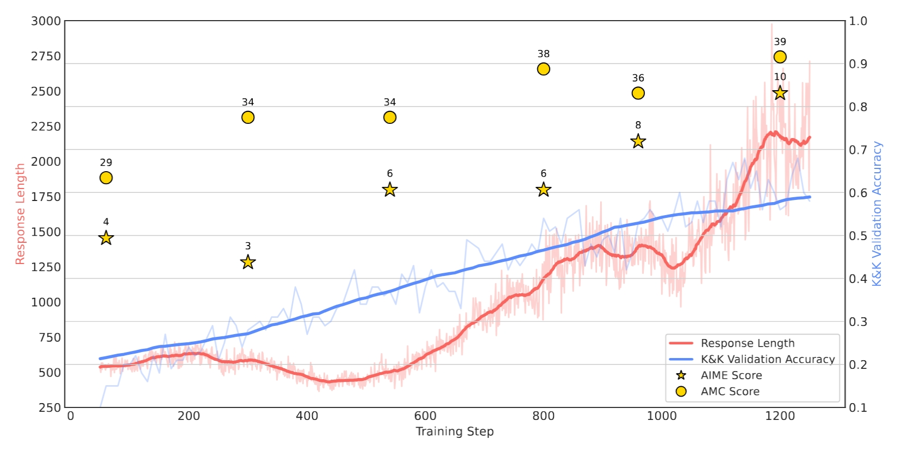

# Logic-RL

## 📢 **Our detailed technical report is released!** 

<a href='https://arxiv.org/abs/2502.14768'></a> &nbsp;

Logic-RL: Unleashing LLM Reasoning with Rule-Based Reinforcement Learning 
---

<table>
  <tr>
    <td align="center">
      
    </td>
  </tr>
  <tr>
    <td align="center">Main results</td>
  </tr>
</table>

---

## Benchmark

| Model                                                             | 2ppl | 3ppl | 4ppl | 5ppl | 6ppl | 7ppl | 8ppl |
|------------------------------------------------------------------------|------|------|------|------|------|------|------|
| o3-mini-high                | 0.99 | 0.98 | 0.97 | 0.95 | 0.94 | 0.89 | 0.83 |
| o1-2024-12-17               | 0.83 | 0.51 | 0.38 | 0.38 | 0.35 | 0.30 | 0.20 |
| GPT-4o                      | 0.68 | 0.57 | 0.49 | 0.32 | 0.23 | 0.21 | 0.11 |
| Deepseek-Math-7b            | 0.35 | 0.21 | 0.08 | 0.06 | 0.02 | 0.00 | 0.00 |
| Qwen2.5-7B-Instruct-1M      | 0.49 | 0.40 | 0.25 | 0.11 | 0.02 | 0.06 | 0.01 |
| Qwen2.5-7B-Logic-RL (ours)  | 0.99 | 0.99 | 0.94 | 0.92 | 0.91 | 0.80 | 0.67 |


---

## Installation

```bash
conda create -n logic python=3.9
pip install torch==2.4.0 --index-url https://download.pytorch.org/whl/cu121
pip3 install vllm==0.6.3 ray
pip3 install flash-attn --no-build-isolation
pip install -e .  # For verl integration
pip install wandb IPython matplotlib
```

---

## Data Preparation

You can directly use /data.

For your own data generation, here's a demo:

### Base Model
```bash
python ./examples/data_preprocess/kk.py \
    --local_dir {processed_data_path} \
    --data_path {raw_data_path}
```

### Instruct Model
```bash
python ./examples/data_preprocess/kk.py \
    --template_type=qwen-instruct \
    --local_dir {processed_data_path} \
    --data_path {raw_data_path}
```

---

## Training Execution
```bash
conda activate logic
bash main_grpo.sh  # 4×A100 80G
```

---

## ⚙️ Implementation Details

| Component              | Location                          |
|------------------------|-----------------------------------|
| Reward Modeling     | `verl/utils/reward_score/kk.py`   |
| Data Preprocessing   | `examples/data_preprocess/kk.py`  |

---


## Citation
```
@misc{xie2025logicrlunleashingllmreasoning,
      title={Logic-RL: Unleashing LLM Reasoning with Rule-Based Reinforcement Learning}, 
      author={Tian Xie and Zitian Gao and Qingnan Ren and Haoming Luo and Yuqian Hong and Bryan Dai and Joey Zhou and Kai Qiu and Zhirong Wu and Chong Luo},
      year={2025},
      eprint={2502.14768},
      archivePrefix={arXiv},
      primaryClass={cs.CL},
      url={https://arxiv.org/abs/2502.14768}, 
}
```

---

## Acknowledgements
- [Verl](https://github.com/volcengine/verl) 🔗
- [TinyZero](https://github.com/Jiayi-Pan/TinyZero) 🔗
- [Knights and Knaves (K&K) puzzles dataset](https://github.com/AlphaPav/mem-kk-logic) 🔗

---

## Star History

[](https://star-history.com/#Unakar/Logic-RL&Date)
